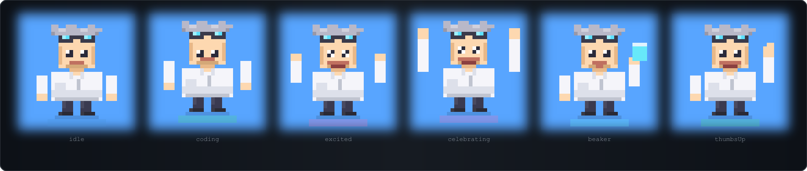
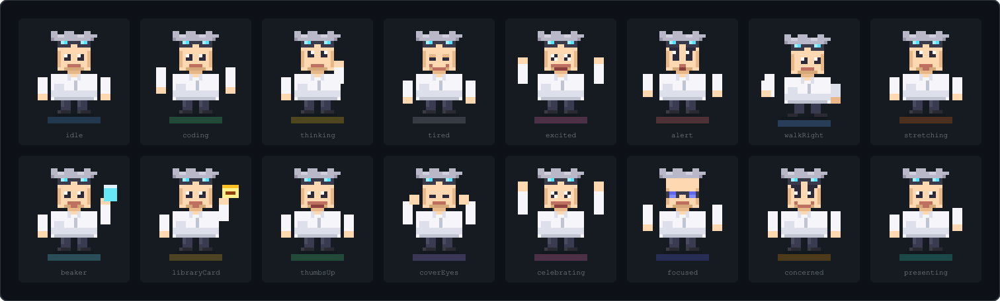
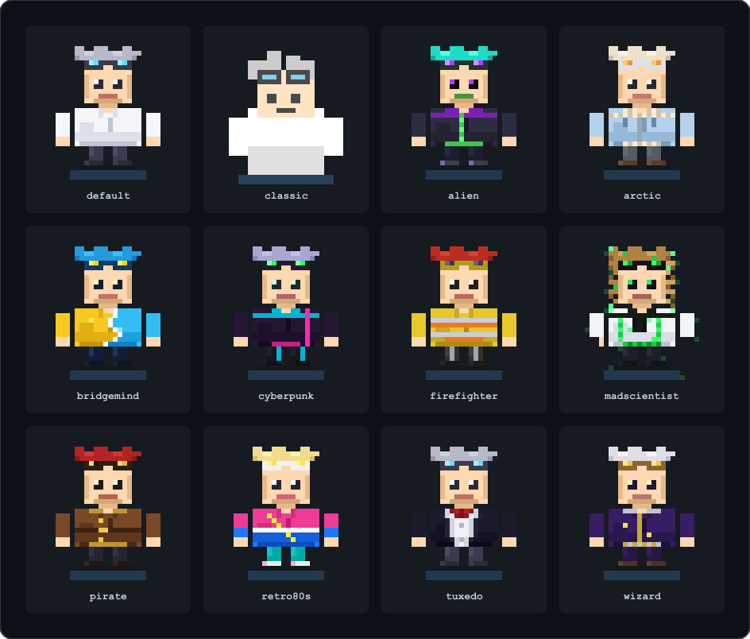

<div align="center">

# Dr. Vibe

**Your AI-Powered Desktop Coding Companion**

A pixel-art mad scientist who lives on your desktop, watches your coding activity, celebrates your wins, keeps you healthy, and integrates with Claude Code.



[](https://tauri.app)
[](https://developer.mozilla.org/en-US/docs/Web/JavaScript)
[](https://www.rust-lang.org)
[](LICENSE)

</div>

---

## What is Dr. Vibe?

Dr. Vibe is a 128x128 pixel character (32x32 sprites at 4x scale) that sits on your desktop in a transparent, always-on-top window. He's never in the way, but he's always watching.

<table>
<tr>
<td width="50%">

**He watches what you do**
- Detects coding in 25+ apps (VS Code, terminals, IDEs)
- Tracks file changes, momentum, and project context
- Notices when you're stuck or fatigued

</td>
<td width="50%">

**He reacts expressively**
- 16 animation states with squash/stretch physics
- Breathing, blinking, and random personality flourishes
- Smooth transitions between every state

</td>
</tr>
<tr>
<td>

**He keeps you healthy**
- Hydration reminders
- Eye strain breaks (20-20-20 rule)
- Posture checks
- Overwork prevention

</td>
<td>

**He celebrates your wins**
- Achievement system with progress tracking
- Personal best records
- Daily streak tracking
- Confetti and particle effects

</td>
</tr>
</table>

---

## Animation States

Dr. Vibe has **16 distinct animation states**, each with unique frame counts, timing profiles, and per-frame duration arrays for organic movement.



| State | Trigger | State | Trigger |
|-------|---------|-------|---------|
| `idle` | Default resting state | `beaker` | Claude Code insights |
| `coding` | Active coding detected | `libraryCard` | Learning resource suggestion |
| `thinking` | Pauses during coding | `thumbsUp` | Positive feedback |
| `tired` | Final 5 min of work timer | `coverEyes` | Eye strain break |
| `excited` | Milestones approaching | `celebrating` | Achievements, personal bests |
| `alert` | Warnings, reminders | `focused` | Focus mode active |
| `walkRight` | Random idle walking | `concerned` | Stuck/fatigue detection |
| `stretching` | Break time, posture | `presenting` | Showing stats |

When idle, Dr. Vibe is never truly still — he breathes, sways, blinks, and occasionally adjusts his goggles or waves.

---

## Skins

12 character skins, each a full replacement spritesheet with unique art:



Each skin also supports **palette-swapped skin tones** applied in real-time via pixel-level canvas manipulation.

---

## Features

### Activity Monitoring

- **Coding detection** across 25+ recognized apps (VS Code, terminals, IntelliJ, vim, etc.)
- **Momentum tracker** — maps file change frequency to 5 levels: cold, warming, flowing, hot, fire
- **Stuck detector** — heuristic detection of "spinning your wheels" patterns
- **Fatigue detector** — monitors declining edit frequency over long sessions
- **Project detection** — scans for `.git`, `package.json`, `Cargo.toml`, etc.

### Claude Code Integration

Deep integration with [Claude Code](https://claude.ai/claude-code) through a hook-based event system:

- **Hotspot commentary** — notices when files get edited repeatedly (3+ to 25+ edits)
- **Refactor radar** — classifies sessions as research, rampage, or surgical
- **Bug squash detector** — recognizes fix-test-fix cycles and celebrates resolution
- **AI pair programming** — detects and celebrates overlapping human + Claude activity
- **Session summary** — natural-language wrap-up when a Claude Code session ends

### Timer & Breaks

- **Pomodoro timer** with configurable work/break/long-break intervals
- **Break modes** — strict pomodoro, smart (activity-adaptive), or manual
- **Focus mode** — dedicated distraction-free sessions with on-screen countdown
- **Break activities** — stretching, walking, hydration suggestions during breaks

### Wellness

- **Hydration reminders** with daily water intake counter
- **Eye strain breaks** — interactive 20-second 20-20-20 countdown
- **Posture checks** — rotating posture tips with countdown
- **Work-life boundaries** — configurable work-end time reminders
- **Overwork prevention** — warns on excessive continuous sessions

### Tracking & Stats

- **Session tracker** — time, files, edits, momentum, project, streak
- **Skill tracker** — cumulative time per language with milestones (1h to 100h)
- **Personal bests** — longest session, most files, highest momentum, most productive day
- **Daily streaks** — consecutive coding days with milestone celebrations
- **Weekly summary** — aggregated stats, trends, top files, achievements

### Achievement System

Unlockable achievements across 9 categories: Getting Started, Consistency, Productivity, Languages, Focus, Wellness, Curiosity, Mastery, and Claude Code.

### Sound System

**Entirely procedural** — no sound files. Everything is synthesized in real-time via Web Audio API.

9 voice presets: mumble, squeaky, gruff, alien, robot, mystic, hyper, retro. Each controls pitch, waveform mix, syllable timing, formants, and vibrato.

---

## Desktop Integration

- **Always on top** — floats above all windows
- **Transparent background** — only the character is visible
- **Click-through ghost mode** — clicks pass through transparent areas
- **Draggable** — click and drag to reposition
- **Walking behavior** — randomly walks across configurable screen boundaries
- **Position persistence** — remembers placement between sessions
- **Quit flow** — shows "Today's Wins" summary before exiting

---

## Getting Started

### Prerequisites

- [Node.js](https://nodejs.org/) 18+
- [Rust](https://rustup.rs/) 1.70+
- [Tauri CLI](https://tauri.app/) 2.0+

### Setup

```bash
npm install

# Development
npm run dev

# Production build
npm run build
```

---

## Architecture

```
dr-vibe/
├── src/
│   ├── core/                    # EventBus, TauriBridge, GameLoop, Database
│   ├── features/
│   │   ├── character/           # SpriteAnimator, Character, Reactions, Walking
│   │   ├── activity/            # ActivityMonitor, ClaudeCode, Momentum, Stuck
│   │   ├── timer/               # Pomodoro, TimerUI, BreakScheduler
│   │   ├── session/             # SessionTracker, Fatigue, Overwork, Weekly
│   │   ├── achievements/        # AchievementSystem, Definitions
│   │   ├── skills/              # SkillTracker (language time tracking)
│   │   ├── sound/               # Procedural audio engine
│   │   ├── hydration/           # Water reminders
│   │   ├── eyestrain/           # 20-20-20 breaks
│   │   ├── posture/             # Posture checks
│   │   ├── encouragement/       # Celebrations & encouragement
│   │   └── ...                  # focus, breaks, learning, resume, etc.
│   ├── ui/                      # Panel components
│   ├── config/                  # Animations, skin tones, resources
│   └── *.html                   # Window HTML files
├── src-tauri/                   # Rust backend (Tauri 2.0)
└── tools/                       # Sprite generation, hooks
```

All modules communicate through a centralized **EventBus** (publish/subscribe). No module directly calls another — 80+ named events keep everything decoupled.

### Tech Stack

| Layer | Technology |
|-------|-----------|
| Frontend | Vanilla JavaScript, HTML5 Canvas, Web Audio API |
| Backend | Tauri 2.0 (Rust) with native window management |
| Persistence | Local unified database (no external DB) |
| Audio | Entirely procedural — zero sound files |
| Graphics | Pixel art spritesheets (32x32) with runtime palette swapping |

---

## Settings

50+ configurable settings across 7 categories:

| Category | Examples |
|----------|---------|
| **Timer** | Work interval (1-120 min), break modes, long break cycles |
| **Wellness** | Hydration frequency, eye strain toggle, posture interval |
| **Character** | Skin selection, skin tone, walking bounds, ghost mode |
| **Audio** | Volume, voice preset, reaction sounds, talk sounds |
| **Features** | Per-feature toggles for encouragement, fatigue, stuck detection |
| **Notifications** | Per-category notification controls |
| **Focus** | Focus duration, persist across restarts |

See [STATE-REFERENCE.md](STATE-REFERENCE.md) for the complete settings reference.

---

## License

[MIT](LICENSE)
